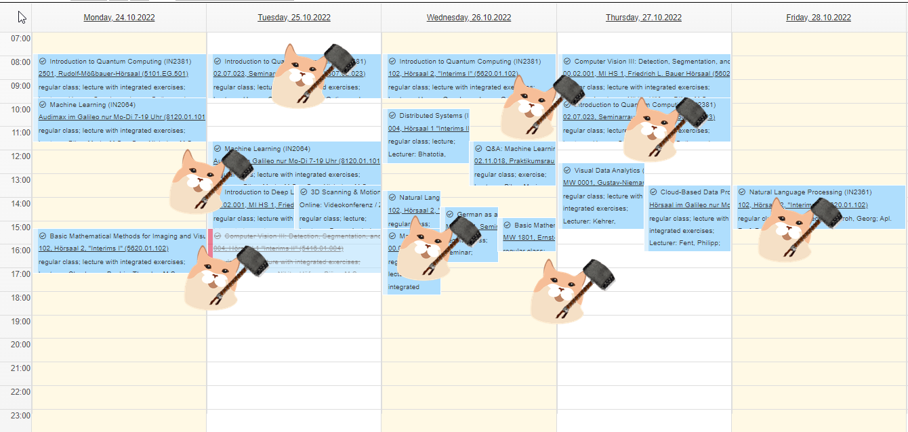
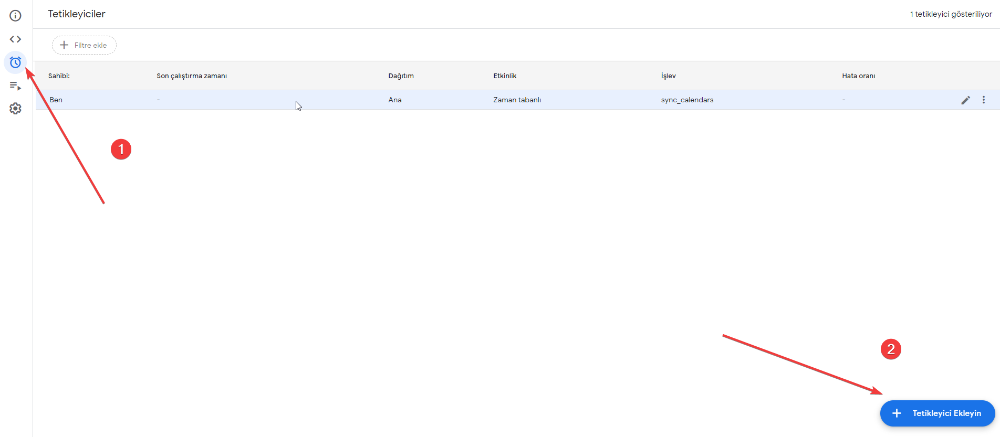

I know that there any many student taking some courses for collecting and archiving necessary documents

So, if you are controlling your life with google calendar and want to see only some of courses in your calendar, 
you are in the right place.

In this repo I will guide you to customizing your TUM Calendar.


Firstly, you need to your Calendar ics link. You can find it like https://wiki.tum.de/display/docs/Personal+Calendar

Then paste your calendar url to https://cal.bruck.me to get rid of all unnecessary titles. 

Now you can subscribe your TUM calendar to your Google calendar. When you subscribe, your calendar automatically will be updated. But the problem is you can not delete or hide events from subscription, rigth? ( Maybe there is a way but I don't know it)

That's way we will also add our ics file to our Google calendar. You can download it if you paste to URL bar. 
ICS file contains events, but they are not updated automatically.

So we have 2 problem :
1. We need to delete some courses from our calendar
2. Also we need to update our calendar automatically

Lets start with first problem.
**Google allow us to manage our calendar with js coding from here : https://script.google.com/home**
_You can look this link to how to use https://rishidhar.me/how-to-bulk-delete-google-calendar-events-via-google-apps-script/_

If you run bellow code with your calendar id, you can delete all unwanted courses easily :D
You can add your courses names in list also you can define allowed date like in the example. Einführung in Quantum Computing will deleted except for wednesday lecture :D
```
//['Sun', 'Mon', 'Tue', 'Wed', 'Thu', 'Fri', 'Sat']
function get_unwanted_courses(){
  return  [  'ML','Grundlegende Mathematische Methoden für Imaging und Visualisierung','Cloud-Based Data Processing'
  ,'3D Scanning & Motion Capture' , 'Fragestunde: ML' , {'course' : 'Einführung in Quantum Computing', 'Allowed' :  [3.0] }]
}
function delete_unnecessary_courses()
{

  var unwanted_courses = get_unwanted_courses()
  //Please note: Months are represented from 0-11 (January=0, February=1). Ensure dates are correct below before running the script.
  var fromDate = new Date(2022,5,1,0,0,0); 
  var toDate = new Date(2023,2,30,0,0,0);
  var main_calendarID = 'abc@gmail.com'; //Enter your calendar ID here

  var calendar = CalendarApp.getCalendarById(main_calendarID);
  for(var i=0; i<unwanted_courses.length;i++) //loop through all events
  {
    var course = unwanted_courses[i];
    var allowed_days = []
    if (typeof course === 'object'){
      allowed_days = course.Allowed ;
      course = course.course ;
    }
    //Search for events between fromdate and todate with given search criteria
    var events = calendar.getEvents(fromDate, toDate,{search: course});
    for(var j=0; j<events.length;j++) //loop through all events
    {
      var ev = events[j];
      //if (ev.getTitle().*
      if (allowed_days !== [] && (allowed_days.indexOf(ev.getStartTime().getDay()) === -1.0)){
          Logger.log('deleted event: '+ev.getTitle()+' found on '+ev.getStartTime()   )  ; // Log event name and title
          ev.deleteEvent(); // delete event
      }else {
        Logger.log('NOT DELETED Event: '+ev.getTitle()+' found on '+ev.getStartTime()  )  ; // Log event name and title
      }
    }
  }
}
delete_unnecessary_courses()

```


For the synchronizing problem, we will use Google script feature again. Iƒ you add your calendar id and subscription calendar id bellow,
this code will sync your calendar with subscription calendar. After edit the code, you can create a trigger like this : 



```


function getDifference(array1, array2) {
  return array1.filter(object1 => {
    return !array2.some(object2 => {
      return (object1.getStartTime().getTime() === object2.getStartTime().getTime()) && (object1.getTitle() ===object2.getTitle())  ;
    });
  });
}

function is_wanted(event){
  var unwanted_courses = get_unwanted_courses()
  for (var j=0; j<unwanted_courses.length;j++){
    var course = unwanted_courses[j]
    if (typeof course !== 'object'){
      if (course.trim().replace('&','') === event.getTitle().trim().replace('&amp','')){
        return false
      }
      else{
        Logger.log(course.trim() + '---' +event.getTitle().trim() )
      }
    }
    else{
      allowed_days = course.Allowed ;
      course = course.course ;
      if (allowed_days.indexOf(event.getStartTime().getDay()) === -1.0){
        return false
      }
      else{
        Logger.log('day' + event.getStartTime().getDay())
      }
    }
  }
  return true
}

function sync_calendars()
{
  var unwanted_courses = get_unwanted_courses()
  //Please note: Months are represented from 0-11 (January=0, February=1). Ensure dates are correct below before running the script.
  var fromDate = new Date(2022,10,1,0,0,0); 
  var toDate = new Date(2023,5,1,0,0,0); 
  var main_calendarID = 'abc@gmail.com'; //Enter your calendar ID here
  var tum_calendarID = '9iqouvu................@import.calendar.google.com'

  var calendar = CalendarApp.getCalendarById(main_calendarID);
  var tum_calendar = CalendarApp.getCalendarById(tum_calendarID);


  //Search for events between fromdate and todate with given search criteria
  var events = calendar.getEvents(fromDate, toDate);
  var tum_events = tum_calendar.getEvents(fromDate, toDate);
  Logger.log('Getting distincts')
  distinct_events = getDifference(tum_events,events)
  for(var j=0; j<distinct_events.length;j++) //loop through all events
  {
    var ev = distinct_events[j];
    if (is_wanted(ev)){
      Logger.log('Syncronized Event: '+ev.getTitle()+' found on '+ev.getStartTime()  )  ; // Log event name and title
      calendar.createEvent(ev.getTitle() , ev.getStartTime() , ev.getEndTime(), {'description' : ev.getDescription() , 'location' : ev.getLocation()})
    }
    
  }
}
sync_calendars()
```